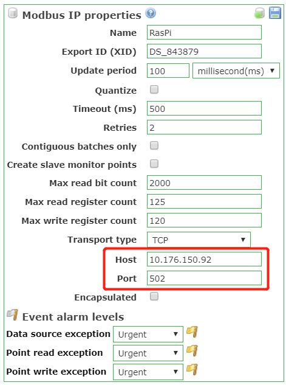
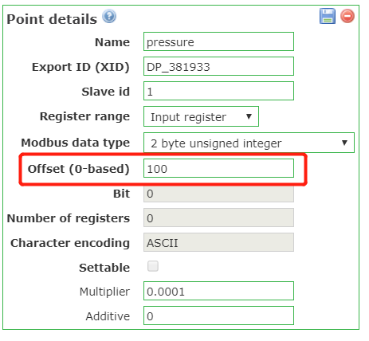
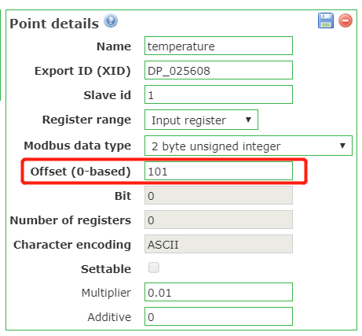

# 1. Sensor
 

# 2. Arduino
 

# 3. Raspberrypi
 

# 4. ScadaBR (Syssec82)
## 4.1 Installation
***Intall ScadaBR in VMs and run it on bridge model, lanuch browser to access the control pages.***
 

## 4.2 Add data source
* ***Add new data source with modbus IP protocol.***
* ***Then configuring ip address.***
* ***Port number for modbus IP is 502***

 
## 4.3 Add point (data item)
***Offset here corresponding to modbus addresses, ScadaBR will connect to OpenPLC via Modbus ip protocol and read from the modbus addresses.  
%IW100 -> 100 (pressure)  
%IW101 -> 101 (temperature)  ***
 

 

# 5 OpenHistorian (Syssec82)
 

# syssec82
**ip: 10.176.150.82  
user: syssec82  
pass: syssec82  
 
ScadaBR: localhost:9090/ScadaBR  
account: admin  
pass: admin  **

